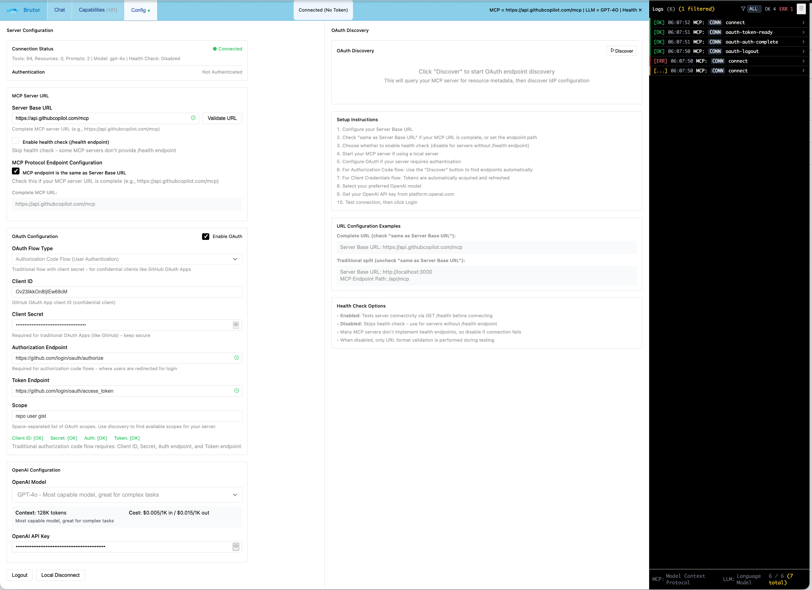

# Brutor MCP Client

A modern React-based web client for interacting with Model Context Protocol (MCP) servers and OpenAI's language models. Brutor provides a comprehensive interface for testing MCP capabilities, managing OAuth authentication, and conducting AI conversations with tool integration.



## Features

### 🔧 MCP Integration
- **Full MCP Protocol Support**: Connect to any MCP server using HTTP transport
- **Interactive Testing**: Test tools, resources, prompts, and resource templates directly in the UI
- **Real-time Capabilities Discovery**: Automatically discover and display server capabilities
- **Content Viewing**: Built-in viewer for text-based resources with syntax highlighting

### 🔐 Authentication & Security
- **Multiple OAuth Flows**: Support for Authorization Code, Authorization Code with PKCE, and Client Credentials flows
- **OAuth Discovery**: Automatic endpoint discovery from MCP servers
- **Token Management**: Secure token storage and automatic refresh
- **User Permissions**: Role-based access control display

### 💬 AI Chat Interface
- **OpenAI Integration**: Chat with GPT models using MCP tools and resources
- **Attachment System**: Attach resources, prompts, and templates to conversations
- **PDF Processing**: Upload and extract text from PDF documents
- **Tool Calling**: Automatic tool invocation during conversations
- **Message Threading**: Support for complex multi-turn conversations

### 🎨 Modern UI/UX
- **Clean Design**: Black and white theme with sky blue accents
- **Responsive Layout**: Optimized for desktop and mobile devices
- **Real-time Logs**: Comprehensive logging panel for debugging
- **Interactive Components**: Collapsible sections, parameter forms, and content viewers

## Quick Start

### Prerequisites
- Node.js 16+ 
- npm or yarn
- An OpenAI API key
- An MCP server to connect to

### Installation

1. **Clone the repository**
   ```bash
   git clone <repository-url>
   cd Brutor-mcp-client
   ```

2. **Install dependencies**
   ```bash
   npm install
   ```

3. **Start the development server**
   ```bash
   npm run dev
   ```

4. **Open your browser**
   Navigate to `http://localhost:3001`

### Configuration

1. **Go to the Config tab**
2. **Configure MCP Server**:
   - Enter your MCP server URL (e.g., `http://localhost:3000`)
   - Set the MCP endpoint path (e.g., `/api/mcp`) or check "same as Server Base URL"
   - Toggle health check as needed
3. **Configure OpenAI**:
   - Enter your OpenAI API key
   - Select your preferred model
4. **Configure OAuth** (if required):
   - Enable OAuth and select the appropriate flow
   - Use the Discovery feature to automatically find endpoints
   - Enter client credentials
5. **Click Connect/Login**

## Usage Guide

### Chat Tab
- **Send Messages**: Type messages and press Enter to send
- **Attach Content**: Use the attachment buttons to include resources, prompts, or PDFs
- **View Responses**: AI responses are formatted with proper styling for lists and code
- **Message History**: All conversations are preserved during the session

### Capabilities Tab
- **Interactive Testing**: Test any MCP capability with parameter configuration
- **Content Preview**: View resource and prompt content before using
- **Result Viewing**: See tool results and error messages in dedicated panels
- **Schema Inspection**: View complete schemas for tools, resources, and prompts

### Config Tab
- **Connection Management**: Connect/disconnect from MCP servers
- **OAuth Discovery**: Automatically discover OAuth endpoints
- **Settings Persistence**: All settings are saved to localStorage
- **Real-time Status**: See connection and authentication status at a glance

### Logs Panel
- **Comprehensive Logging**: All MCP and OpenAI operations are logged
- **Filtering**: Filter logs by source (MCP/LLM) and status
- **Deduplication**: Automatic removal of duplicate log entries
- **Debugging**: Detailed request/response information for troubleshooting

## Configuration Examples

### Local MCP Server
```
Server Base URL: http://localhost:3000
MCP Endpoint Path: /api/mcp
OAuth: Disabled
Health Check: Enabled
```

### GitHub Copilot MCP
```
Server Base URL: https://api.githubcopilot.com/mcp
Same as Server Base URL: ✓
OAuth Flow: Authorization Code (traditional)
Client ID: your-github-app-client-id
Client Secret: your-github-app-secret
```

### Keycloak-protected MCP Server
```
Server Base URL: https://your-server.com
MCP Endpoint Path: /api/mcp
OAuth Flow: Authorization Code with PKCE
Client ID: mcp-spa-client
Use Discovery: ✓ (to find endpoints automatically)
```

## OAuth Flows

### Authorization Code with PKCE
- **Best for**: Single-page applications and public clients
- **Security**: Uses PKCE for enhanced security without client secrets
- **Setup**: Only requires client ID, endpoints discovered automatically

### Authorization Code (Traditional)
- **Best for**: GitHub OAuth Apps and confidential clients
- **Security**: Requires client secret for token exchange
- **Setup**: Requires client ID, client secret, and OAuth endpoints

### Client Credentials
- **Best for**: Service-to-service authentication
- **Security**: Uses client credentials for direct token exchange
- **Setup**: Requires client ID, client secret, and token endpoint

## Architecture

### Core Components
- **App.tsx**: Main application shell with routing and Brutor branding
- **useMCP.ts**: Hook for MCP server communication
- **useChat.ts**: Hook for chat functionality and message management
- **mcpClient.ts**: MCP protocol client implementation
- **openaiClient.ts**: OpenAI API client with tool integration

### Authentication
- **OAuthTokenManager.ts**: Unified OAuth token management
- **AuthCodeFlowManager.ts**: PKCE flow implementation
- **TraditionalAuthCodeFlowManager.ts**: Traditional OAuth flow

### UI Components
- **ChatTab.tsx**: Main chat interface with Brutor welcome
- **CapabilitiesTab.tsx**: Interactive MCP testing
- **ConfigTab.tsx**: Configuration and connection management
- **LogsPanel.tsx**: Real-time operation logging
- **WhaleLogo.tsx**: Animated Brutor branding component

## Development

### Available Scripts
```bash
npm run dev          # Start development server
npm run build        # Build for production
npm run preview      # Preview production build
npm run lint         # Run ESLint
npm run type-check   # Run TypeScript type checking
npm run format       # Format code with Prettier
```

### Project Structure
```
src/
├── components/          # React components including WhaleLogo
├── hooks/              # Custom React hooks
├── lib/                # Core libraries (MCP, OAuth, OpenAI)
├── styles/             # CSS and styling
├── types/              # TypeScript type definitions
└── main.tsx           # Application entry point

public/
└── Brutor-icon.svg    # Brutor favicon
```

### Key Dependencies
- **React 18**: Modern React with hooks and concurrent features
- **TypeScript**: Type-safe development
- **@modelcontextprotocol/sdk**: Official MCP SDK
- **Tailwind CSS**: Utility-first CSS framework
- **Lucide React**: Icon library
- **PDF.js**: PDF processing capabilities
- **jwt-decode**: JWT token decoding for OAuth flows

## Troubleshooting

### Connection Issues
1. **Health Check Failures**: Disable health check if your MCP server doesn't provide `/health`
2. **CORS Errors**: Ensure your MCP server has proper CORS headers
3. **OAuth Redirect Issues**: Verify redirect URIs match your application URL
4. **Port Conflicts**: Default dev server runs on port 3001, ensure it's available

### Authentication Problems
1. **OAuth Discovery Fails**: Manually configure endpoints if discovery doesn't work
2. **Token Refresh Issues**: Clear localStorage and re-authenticate
3. **Permission Errors**: Check user roles and scopes in OAuth configuration
4. **PKCE Flow Issues**: Ensure your OAuth provider supports PKCE

### Performance
1. **Large Messages**: Long content is automatically collapsed with expand/collapse controls
2. **Memory Usage**: Logs are automatically limited to 100 entries with deduplication
3. **Rendering**: Complex parameter forms use React optimization patterns
4. **PDF Processing**: Large PDFs are processed client-side, may take time

### UI/UX Issues
1. **Logo Not Displaying**: Ensure `Brutor-icon.svg` is in the `public/` directory
2. **Animations Not Working**: Check that CSS animations are not disabled by user preferences
3. **Mobile Layout**: Use responsive design features, test on different screen sizes

## Contributing

1. Fork the repository
2. Create a feature branch (`git checkout -b feature/amazing-feature`)
3. Make your changes
4. Run tests and linting (`npm run lint && npm run type-check`)
5. Commit your changes (`git commit -m 'Add amazing feature'`)
6. Push to the branch (`git push origin feature/amazing-feature`)
7. Submit a pull request

### Development Guidelines
- Follow the existing code style and TypeScript patterns
- Add appropriate type definitions for new features
- Include JSDoc comments for complex functions
- Test OAuth flows thoroughly before submitting
- Ensure responsive design works on mobile devices

## License

This project is licensed under the Apache License 2.0. See the [LICENSE](LICENSE) file for details.

## Support

For issues and questions:

1. **Check the Logs Panel**: The built-in logs panel provides detailed error information
2. **Verify MCP Server**: Ensure your MCP server is compatible with the MCP protocol specification
3. **OAuth Configuration**: Make sure OAuth configuration matches your identity provider settings
4. **Browser Console**: Review the browser console for additional debugging information
5. **GitHub Issues**: Report bugs and request features via GitHub issues

## Acknowledgments

- Built with the official [Model Context Protocol SDK](https://github.com/modelcontextprotocol/sdk)
- Inspired by the need for better MCP server testing and interaction tools
- Brutor logo and branding designed for intelligent multi-tentacled tool handling
- Special thanks to the MCP community for protocol development and feedback

---

*Brutor MCP Client - Intelligently connecting you to the Model Context Protocol ecosystem* 🐙