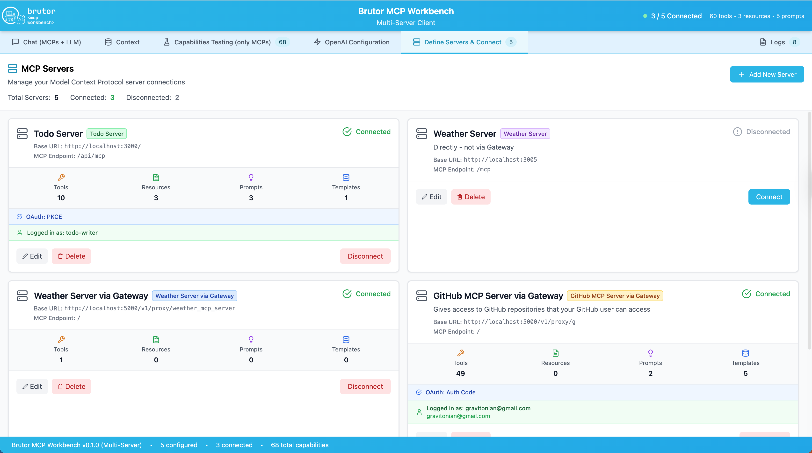

# Brutor MCP Workbench

A modern React-based web client for interacting with multiple Model Context Protocol (MCP) servers and OpenAI's
language models. Brutor provides a comprehensive interface for testing MCP capabilities, managing OAuth authentication,
and conducting AI conversations with multi-server tool integration.



## What is Brutor MCP Workbench?

Brutor is an intelligent, interactive workbench for developing and testing MCP (Model Context Protocol) servers.
Think of it as your Swiss Army knife for MCP development - it helps you:

- **Test multiple MCP servers simultaneously** - connect to multiple servers and use their capabilities together
- **Test MCP servers in isolation** - verify tools, resources, and prompts work correctly
- **Test MCP servers with AI** - see how your MCP servers integrate with language models
- **Debug OAuth flows** - comprehensive OAuth support with automatic discovery
- **Monitor operations** - real-time logging of all MCP and LLM interactions with server attribution
- **Manage context** - view and edit the LLM context window to optimize token usage
- **Develop faster** - interactive UI for rapid iteration on MCP servers

## ✨ Key Features

### Multi-Server Support (NEW!)
- **Multiple Simultaneous Connections**: Connect to multiple MCP servers at once
- **Server Attribution**: Every tool, resource, and prompt shows which server it comes from
- **Visual Server Identification**: Color-coded badges for each server across the entire UI
- **Aggregated Capabilities**: All capabilities from all servers in one unified interface
- **Intelligent Tool Routing**: Automatically routes tool calls to the correct server
- **Per-Server Configuration**: Individual OAuth, endpoint, and test settings for each server
- **Server Management**: Enable/disable servers, reorder them, and view detailed information

### Comprehensive MCP Integration
- **Full MCP Protocol Support**: Connect to any MCP server using HTTP transport with StreamableHTTP
- **Interactive Testing**: Test tools, resources, prompts, and resource templates directly in the UI
- **Smart Parameter Handling**: Visual forms with proper validation for required vs optional parameters
- **Real-time Capabilities Discovery**: Automatically discover and display server capabilities
- **Content Viewing**: Built-in viewer for text-based resources with syntax highlighting
- **Resource Templates**: Dynamic resource generation with parameterized URIs
- **Pre-Connection Tests**: Port, CORS, and health endpoint validation before connecting

### Advanced Authentication & Security
- **Multiple OAuth Flows**: Support for:
    - Authorization Code with PKCE (recommended for browser apps)
    - Authorization Code (traditional, for GitHub OAuth Apps)
    - Client Credentials (service-to-service)
- **Per-Server OAuth**: Each server can have its own OAuth configuration
- **OAuth Discovery**: Automatic endpoint discovery from MCP servers via `.well-known` endpoints
- **Token Management**: Secure token storage with automatic refresh
- **User Permissions**: Role-based access control display with read/write permissions
- **Scope Validation**: Intelligent scope error detection with actionable guidance
- **Multi-Provider Support**: Works with Keycloak, GitHub, Auth0, Okta, and custom OAuth providers

### Intelligent Chat Interface
- **Multi-Server Tool Calling**: LLM can call tools from any connected server
- **OpenAI Integration**: Chat with GPT models (GPT-4o, GPT-4o Mini, GPT-4 Turbo) using MCP tools and resources
- **Proxy Support**: Optional proxy server for secure API key management and CORS handling
- **Smart Attachment System**: Attach and use:
    - Resources (static content from any MCP server)
    - Resource Templates (dynamic resources with parameters from any server)
    - Prompts (pre-configured message templates with argument configuration from any server)
    - PDF Documents (with automatic text extraction)
- **Unified Attachment Panel**: Browse and configure all attachment types in one interface with:
    - Three tabs: Resources | Templates | Prompts
    - Parameter configuration for prompts and templates before attaching
    - Live URI preview for resource templates
    - Search and server filtering
- **Server Attribution in Chat**: Tool calls and responses show which server was used
- **Tool Calling**: Automatic tool invocation with multi-turn support across servers
- **Message Threading**: Complex multi-turn conversations with context preservation
- **Content Management**: Smart message collapsing for long content with expand/collapse
- **Processing Indicator**: Visual hourglass overlay shows when AI is thinking or calling tools

### Context Manager (NEW!)
- **Context Window Visualization**: See exactly what's being sent to the LLM
- **Token Estimation**: Real-time token count with visual warnings
- **Message Management**: Remove individual messages to reduce context size
- **Attachment Control**: Remove specific attachments from messages
- **Capability Overview**: View all tools, resources, prompts, and templates in context
- **Statistics Dashboard**: Track message counts, tool calls, attachments, and more
- **Smart Recommendations**: Get suggestions when context is getting too large
- **Copy Context**: Export full context as JSON for debugging

### Interactive Capabilities Testing
- **Multi-Server Capabilities**: Test capabilities from any connected server
- **Server Filtering**: Filter capabilities by specific server or view all
- **Compact Default View**: Shows only capability name and ID (e.g., "List Todo Items (list_todo_items)")
- **Expandable Details**: Click arrow to see full description, parameters, and configuration
- **Smart Parameter Handling**:
    - Visual indicator (⚙️ Settings icon) when parameters are required
    - Required parameters clearly marked with red asterisk (*)
    - Optional parameters support null values
    - Run button disabled (gray) when required parameters are missing
    - Run button enabled (blue) when all requirements are met
- **Isolated Testing**: Test MCP capabilities without involving the LLM
- **Parameter Configuration**: Visual forms for tool arguments, prompt parameters, and template values
- **Live Preview**: See resource template URIs resolved in real-time
- **Result Viewing**: Dedicated panels for test results with success/error states
- **Content Viewer**: Modal viewer for resources, prompts, and templates
- **Schema Inspection**: View complete JSON schemas for all capabilities
- **Error Containment**: Test errors stay in Capabilities tab and don't pollute chat

### Modern UI/UX
- **Clean Design**: Modern theme with sky blue (#1BB5E8) accents
- **Server Color Coding**: Each server has a unique color throughout the interface
- **Responsive Layout**: Optimized for desktop and mobile devices
- **Real-time Logs**: Comprehensive logging panel with server attribution and filtering
- **Interactive Components**: Collapsible sections, parameter forms, content viewers
- **Status Indicators**: Visual feedback for connection state, OAuth status, and operations
- **Error Handling**: User-friendly error modals with detailed diagnostics
- **Processing Feedback**: Large, prominent loading indicators during AI operations

### Advanced Logging & Monitoring (Enhanced!)
- **Dual-Source Logging**: Separate logs for MCP operations and LLM calls
- **Server Attribution**: Every log entry shows which server was involved
- **Server Filtering**: Filter logs by specific server or view all
- **Source Filtering**: Filter by source (MCP/LLM) and status (success/error/pending)
- **Deduplication**: Automatic removal of duplicate log entries
- **Rich Details**: Expandable logs with full request/response data and server information
- **Performance Metrics**: Duration tracking for all operations
- **Color-Coded Status**: Visual indicators for success (green), error (red), pending (amber)
- **Dark Theme**: Professional dark mode for the logs panel

## Quick Start

### Prerequisites
- Node.js 16+
- npm or yarn
- An OpenAI API key (configured either directly or via proxy)
- One or more MCP servers to connect to

### Installation

1. **Clone the repository**
```bash
   git clone <repository-url>
   cd brutor-mcp-workbench
```

2. **Install dependencies**
```bash
   npm install
```

3. **Start the development server**
```bash
   npm run dev
```

4. **Open your browser**
   Navigate to `http://localhost:3004`

### Configuration

1. **Go to the "Servers" tab**

2. **Add Your First Server**:
    - Click "Add New Server"
    - Enter server name (e.g., "My Todo Server")
    - Enter server base URL (e.g., `http://localhost:3000`)
    - Set the MCP endpoint path (e.g., `/api/mcp`) or check "same as Server Base URL"
    - Choose a color for visual identification
    - Configure pre-connection tests:
        - Port Check: Verifies server is reachable
        - CORS Check: Validates CORS configuration
        - Health Check: Tests `/health` endpoint (optional)
    - Configure OAuth if needed
    - Click "Save"

3. **Add More Servers** (Optional):
    - Repeat the process to add additional MCP servers
    - Each server can have different settings, colors, and OAuth

4. **Configure OpenAI** (in Configure tab):
    - Select your preferred model (GPT-4o, GPT-4o Mini, or GPT-4 Turbo)
    - **Option 1**: Enter proxy server URL (recommended for production and CORS handling)
    - **Option 2**: Leave proxy URL empty to connect directly to OpenAI

5. **Connect to Servers**:
    - Go to the "Connect" tab
    - Click "Connect All" or connect to servers individually
    - OAuth servers will prompt for login

## OpenAI Proxy Setup

To get around the CORS problem you are going to need a proxy for your LLM completion calls.
For production deployments, it's recommended to use a proxy server to keep your OpenAI API key secure.

### Setting up the Proxy

1. **Navigate to the proxy directory**:
```bash
   cd openai-proxy
```

2. **Install proxy dependencies**:
```bash
   npm install
```

3. **Configure the proxy**:
```bash
   export OPENAI_API_KEY=your_api_key_here
   export PORT=3010  # optional, defaults to 3010
```

4. **Start the proxy server**:
```bash
   npm start
   # or for development with auto-restart:
   npm run dev
```

5. **Configure Brutor to use the proxy**:
    - In the Configure tab → OpenAI tab
    - Enter `http://localhost:3010` in the Proxy Server URL field
    - Leave empty to connect directly to OpenAI

### Proxy Benefits
- **CORS**: Solves the problem that browsers/webapps cannot just connect to a different domain - blocked
- **Security**: API key never exposed to the client
- **Centralized Management**: One place to manage API keys
- **Rate Limiting**: Add custom rate limiting middleware
- **Logging**: Monitor all API requests
- **Caching**: Cache responses to reduce costs
- **Access Control**: Implement custom authentication

## Usage Guide

### Define Servers & Connect Tab - "Manage Multiple MCP Servers" (NEW!)
The Servers tab is your central hub for managing all MCP server connections.

**Features:**
- **Add/Edit/Delete Servers**: Complete server lifecycle management
- **Server Configuration**:
    - Name and description for each server
    - Base URL and endpoint configuration
    - Visual color assignment for identification
    - Individual OAuth settings
    - Per-server pre-connection tests
- **Connection Management**:
    - Connect/disconnect individual servers
    - View connection status at a glance
    - Server capability counts
- **Visual Organization**:
    - Color-coded server cards
    - Connection status indicators
    - Capability summaries
- **Quick Actions**: Edit, connect, or delete servers with one click

**Use Cases:**
- Manage multiple development servers
- Connect to different environments (dev, staging, prod)
- Test tool interactions across different servers
- Compare capabilities between servers

### Chat Tab - "Test Multiple MCP Servers with LLM"
The Chat tab integrates all your MCP servers with OpenAI's language models for intelligent conversations.

**Features:**
- **Send Messages**: Type messages and press Enter to send
- **Multi-Server Tool Calling**: LLM automatically calls tools from any connected server
- **Server Attribution**: See which server each tool was called on
- **Unified Attachment Panel**: Single button opens a comprehensive attachment browser with:
    - **Three Tabs**:
        - Resources: Browse static content from all servers
        - Templates: Configure dynamic resources with parameters
        - Prompts: Select and configure prompt templates with arguments
    - **Smart Configuration**:
        - Prompts with arguments show configuration screen before attaching
        - Templates with parameters show URI builder with live preview
        - Resources attach directly (no configuration needed)
    - **Visual Feedback**:
        - Parameter badges show count (e.g., "3 params", "2 args")
        - Required parameters marked with asterisk (*)
        - Blue "Attach" button when ready, gray when incomplete
    - **Search & Filter**: Find content across all servers quickly
- **Processing Indicator**: Large hourglass animation shows when AI is thinking
- **Tool Calling**: Automatically invokes MCP tools based on conversation context
- **View Responses**: AI responses with formatted lists, code blocks, and citations
- **Message History**: Complete conversation history with expand/collapse for long messages
- **Streaming Support**: Real-time responses from the language model

**Use Cases:**
- Test how multiple MCP servers work together with AI
- Verify tool calling works correctly across different servers
- Develop and test complex multi-server workflows
- Validate resource and prompt attachments from various sources

### Context Tab - "Manage LLM Context Window" (NEW!)
The Context tab gives you complete visibility and control over what's being sent to the LLM.

**Features:**
- **Three View Modes**:
    - **Summary**: Overview with token count, statistics, and recommendations
    - **Messages**: Full message history with editing capabilities
    - **Capabilities**: View all tools, resources, prompts, and templates

**Summary View:**
- Token usage with color-coded warnings (green < 4K, amber < 8K, red 8K+)
- Message statistics (user, assistant, tool messages)
- Attachment counts and server statistics
- Capability breakdown by type
- Smart recommendations when context is large

**Messages View:**
- Expand/collapse individual messages
- Remove specific messages to reduce context
- Remove individual attachments from messages
- View token estimates per message
- See message types (user, assistant, tool, system)
- Inspect tool calls and attachments

**Capabilities View:**
- View all tools with server attribution
- List of all resources available
- Prompt and template counts
- Per-server capability breakdown

**Actions:**
- Copy entire context as JSON
- Clear all messages at once
- Remove specific messages or attachments
- Monitor token usage in real-time

**Use Cases:**
- Optimize context window usage
- Debug what's being sent to the LLM
- Remove old messages to stay under token limits
- Verify attachments are included correctly
- Analyze capability distribution across servers

### Capabilities Tab - "Test Multiple MCP Servers"
The Capabilities tab lets you test capabilities from all connected servers in isolation, without involving the LLM.

**Features:**
- **Compact Default View**:
    - Shows only capability name and ID in collapsed state
    - Example: "List Todo Items (list_todo_items)"
    - Expansion arrow on the left to reveal details
    - Action buttons on the right for quick access
- **Smart Action Buttons**:
    - **⚙️ Settings Icon**: Appears when capability has configurable parameters
    - **▶️ Run Button**:
        - Gray and disabled when required parameters are missing
        - Blue and enabled when all requirements are met
        - Shows different icons based on capability type (Play/Download)
- **Expandable Details**: Click arrow to reveal:
    - Full description
    - Parameter configuration forms
    - Schema inspection tools
    - Test result display
- **Multi-Server View**: See capabilities from all servers in one place
- **Server Filtering**: Filter by specific server or view all
- **Server Attribution**: Color-coded badges show which server each capability is from
- **Interactive Testing**: Test any capability with parameter configuration
- **Visual Parameter Forms**:
    - Text inputs with validation
    - Dropdowns for enums
    - Checkboxes for booleans (with null support for optional parameters)
    - Number inputs with min/max validation
    - Required parameters marked with red asterisk (*)
- **Content Preview**: View resource and prompt content before using
- **Result Viewing**: Dedicated panels for success and error states
- **Error Containment**: Test errors stay in Capabilities tab and don't pollute chat
- **Schema Inspection**: View complete JSON schemas with expand/collapse
- **Resource Template Testing**: Fill in parameters and see URI resolution

**Use Cases:**
- Verify MCP server functionality without AI overhead
- Debug tool implementations across servers
- Test resource templates with different parameters
- Compare capabilities between servers
- Validate prompt generation from multiple sources
- Quickly test capabilities without leaving the page

### OpenAI Configure 
The Configure tab provides comprehensive configuration for OpenAI and system settings.

**OpenAI Configuration**:
- Model selection (GPT-4o, GPT-4o Mini, GPT-4 Turbo)
- Proxy URL configuration
- Model information (context window, pricing)
- Direct OpenAI connection support

### Logs Panel - "Monitor Multi-Server Operations" (Enhanced!)
The Logs Panel provides comprehensive monitoring of all operations across all servers.

**Features:**
- **Dual-Source Logging**:
    - MCP: All Model Context Protocol operations
    - LLM: All language model interactions
- **Server Attribution**: Every log shows which server was involved with color-coded badges
- **Advanced Filtering**:
    - Filter by source (ALL/MCP/LLM)
    - Filter by server (ALL/specific server/no server)
    - Filter by status
- **Dark Theme**: Professional dark mode with high contrast
- **Expandable Entries**: Click to see full request/response details and server info
- **Status Indicators**: Color-coded icons for success (green), error (red), and pending (amber)
- **Deduplication**: Automatic removal of duplicate entries
- **Performance Tracking**: Operation duration for all requests
- **Statistics**: Real-time counts of successful and failed operations by server

**Log Types:**
- `TOOL`: Tool execution logs with server attribution
- `RESOURCE`: Resource read operations
- `PROMPT`: Prompt retrieval
- `CONN`: Connection and authentication
- `CHAT`: Chat completion logs
- `COMP`: Completion requests
- `EMBED`: Embedding operations

## OAuth Flow Details

### Authorization Code with PKCE (Recommended)
**Best for**: Single-page applications, mobile apps, public clients

**Features:**
- Enhanced security without client secrets
- Uses Proof Key for Code Exchange (PKCE)
- Supports automatic endpoint discovery
- Includes logout with optional IdP redirect
- Role-based permissions (read/write)

**Setup:**
1. Configure client as "public" in OAuth provider
2. Enable PKCE support
3. Add redirect URI: `http://localhost:3004/callback`
4. Use Discovery to find endpoints automatically
5. Configure scopes (Discovery helps find valid ones)

### Authorization Code (Traditional)
**Best for**: GitHub OAuth Apps, confidential clients

**Features:**
- Traditional OAuth flow with client secret
- Suitable for server-side or confidential clients
- Token exchange requires client secret
- User authentication with roles

**Setup:**
1. Configure client with client secret
2. Add redirect URI: `http://localhost:3004/callback`
3. Manually configure or discover endpoints
4. Ensure client secret is kept secure

### Client Credentials
**Best for**: Service-to-service authentication

**Features:**
- Direct token exchange using client credentials
- No user authentication required
- Ideal for backend services
- Full permissions (read/write)

**Setup:**
1. Configure client with client secret
2. Only token endpoint required
3. Scope is optional but recommended
4. Suitable for automated workflows

## OpenAI Models

### GPT-4o
- **Best for**: Complex reasoning, multimodal tasks, specialized applications
- **Context Window**: 128K tokens
- **Pricing**: $2.50/1M input tokens, $10.00/1M output tokens
- **Features**: Text, image, and audio processing

### GPT-4o Mini
- **Best for**: Fast and affordable everyday tasks
- **Context Window**: 128K tokens
- **Pricing**: $0.15/1M input tokens, $0.60/1M output tokens
- **Features**: Cost-efficient with strong performance

### GPT-4 Turbo
- **Best for**: Reliable previous generation performance
- **Context Window**: 128K tokens
- **Pricing**: $10.00/1M input tokens, $30.00/1M output tokens
- **Features**: Proven reliability for production workloads

## Architecture

### Core Components

**Frontend (React + TypeScript):**
- `App.tsx`: Main application shell with multi-server state management
- `useMultiServerMCP.ts`: React hook for managing multiple MCP server connections
- `useMultiServerChat.ts`: Hook for chat functionality with multi-server tool routing
- `mcpClient.ts`: MCP protocol client with StreamableHTTP transport
- `openaiClient.ts`: OpenAI API client with proxy support and tool integration

**Multi-Server Components (NEW):**
- `ServersTab.tsx`: Server management interface
- `ServerConfigDialog.tsx`: Server configuration modal
- `ServerCard.tsx`: Individual server display with status
- `ServerBadge.tsx`: Color-coded server identification badge
- `ContextTab.tsx`: Context window manager and editor

**Authentication:**
- `OAuthTokenManager.ts`: Unified OAuth token management for all flows
- `AuthCodeFlowManager.ts`: PKCE flow implementation with automatic token refresh
- `TraditionalAuthCodeFlowManager.ts`: Traditional OAuth flow (GitHub support)
- Automatic token refresh and validation per server
- Scope error detection and guidance

**UI Components:**
- `ChatTab.tsx`: Chat interface with unified attachment panel
- `CapabilitiesTab.tsx`: Interactive MCP testing interface with compact view
- `OpenAITab.tsx`: OpenAI model and proxy configuration
- `OAuthTab.tsx`: OAuth configuration with discovery
- `LogsPanel.tsx`: Real-time operation logging with server attribution
- `ContextTab.tsx`: Context window visualization and management
- `BrutorLogo.tsx`: Animated branding component
- `MessageRenderer.tsx`: Chat message rendering with server badges
- `UniversalContentViewer.tsx`: Modal viewer for resources, prompts, and templates
- `TestableCapabilitiesList.tsx`: Interactive capability testing with smart parameter handling

**Utility Components:**
- `AttachmentPanel.tsx`: Unified attachment browser with three tabs (Resources/Templates/Prompts)
- `PdfUploader.tsx`: PDF processing with text extraction
- `ConnectionErrorModal.tsx`: Detailed error diagnostics
- `ScopeErrorAlert.tsx`: OAuth scope error guidance

**Proxy Server:**
- `openai-proxy/server.js`: Express-based proxy for OpenAI API
- `openai-proxy/package.json`: Proxy dependencies and scripts
- Request forwarding with authentication
- Support for streaming responses

### Data Flow

1. **Multi-Server Connection Flow** (UPDATED):
    - User configures multiple MCP servers in Servers tab
    - Each server has independent settings (URL, OAuth, colors, tests)
    - Pre-connection tests run for each server
    - OAuth tokens acquired per server if enabled
    - Multiple MCP clients connect simultaneously
    - Capabilities aggregated from all servers with attribution

2. **Multi-Server Chat Flow** (UPDATED):
    - User clicks attachment button to open unified panel
    - Three tabs available: Resources, Templates, Prompts
    - For prompts with arguments: configuration screen appears
    - For templates with parameters: URI builder with preview shown
    - For resources: direct attachment (no configuration)
    - User configures parameters and clicks blue "Attach" button
    - Message context built with attachment content
    - OpenAI called with conversation history and tools from ALL servers
    - Tool calls automatically routed to correct server
    - Results include server attribution
    - Multi-turn tool calling supported across servers

3. **Testing Flow** (UPDATED):
    - User views compact capability list (name + ID only)
    - Settings icon (⚙️) indicates configurable parameters
    - Click expansion arrow to see full details
    - Configure required parameters (marked with *)
    - Run button changes from gray (disabled) to blue (enabled)
    - Test executed directly against specific MCP server
    - Results displayed in Capabilities tab (not in chat)
    - Content viewer available for successful resource reads

4. **Context Management Flow** (NEW):
    - User views context in Context tab
    - Token estimation shows total size with warnings
    - User can remove messages or attachments
    - Context automatically updated
    - Recommendations provided for optimization
    - Copy context for debugging

5. **OAuth Flow** (PER-SERVER):
    - User clicks Login for specific server
    - Redirected to OAuth provider
    - Authorization code returned to callback
    - Token exchange performed (with PKCE or client secret)
    - Tokens stored per server
    - Refresh handled transparently per server
    - Logout supports both local and IdP logout

## Development

### Available Scripts
```bash
npm run dev          # Start development server (port 3004)
npm run build        # Build for production
npm run preview      # Preview production build
npm run lint         # Run ESLint
npm run type-check   # Run TypeScript type checking
npm run format       # Format code with Prettier
```

### Proxy Server Scripts
```bash
cd openai-proxy
npm start            # Start proxy server
npm run dev          # Start with nodemon (auto-restart)
```

### Project Structure
```
src/
├── components/
│   ├── chat/              # Chat interface components
│   │   ├── ChatTab.tsx
│   │   ├── MessageRenderer.tsx
│   │   └── AttachmentPanel.tsx (Unified three-tab panel)
│   ├── capabilities_test/ # Testing interface components
│   │   └── TestableCapabilitiesList.tsx (Compact view with smart buttons)
│   ├── config_and_connect/# Configuration components
│   ├── BrutorLogo.tsx     # Branding component
│   ├── ContextTab.tsx     # Context manager (NEW)
│   ├── LogsPanel.tsx      # Logging component (ENHANCED)
│   ├── ServersTab.tsx     # Server management (NEW)
│   ├── ServerCard.tsx     # Server display (NEW)
│   ├── ServerBadge.tsx    # Server identification (NEW)
│   └── OAuthCallback.tsx  # OAuth callback handler
├── hooks/
│   ├── useMultiServerChat.ts  # Multi-server chat hook (NEW)
│   └── useMultiServerMCP.ts   # Multi-server MCP hook (NEW)
├── lib/
│   ├── mcpClient.ts       # MCP protocol client
│   ├── openaiClient.ts    # OpenAI API client
│   ├── OAuthTokenManager.ts          # Token management
│   ├── AuthCodeFlowManager.ts        # PKCE flow
│   └── TraditionalAuthCodeFlowManager.ts # Traditional OAuth
├── types/
│   └── index.ts           # TypeScript definitions (UPDATED)
├── styles/                # CSS and styling
└── main.tsx              # Application entry point

openai-proxy/
├── server.js             # Express proxy server
├── package.json          # Dependencies
└── README.md            # Proxy documentation

public/
└── brutor-logo.png      # Branding assets
```

### Key Technologies
- **React 18**: Modern React with hooks and concurrent features
- **TypeScript**: Type-safe development with strict mode
- **@modelcontextprotocol/sdk**: Official MCP SDK with StreamableHTTP support
- **Tailwind CSS**: Utility-first CSS framework
- **Lucide React**: Modern icon library
- **PDF.js**: Client-side PDF text extraction
- **jwt-decode**: JWT token parsing for user info
- **Express**: Proxy server framework
- **node-fetch**: HTTP client for proxy
- **React Router**: Client-side routing for OAuth callbacks

## Troubleshooting

### Multi-Server Issues (NEW)

**Tool Routing Failures:**
- Check that tool names are unique across servers
- Review logs to see which server is being called
- Verify all servers are connected
- Check server badges in Capabilities tab

**Context Too Large:**
- Use Context tab to view token usage
- Remove old messages that are no longer relevant
- Remove attachments that have been processed
- Clear conversation and start fresh if needed

**Server Color Confusion:**
- Edit server configuration to change colors
- Use distinct colors for each server
- Server badges appear throughout the UI

**Attachment Configuration:**
- Ensure required parameters are filled (marked with *)
- Blue "Attach" button indicates ready to attach
- Gray button means parameters are missing
- Check parameter badges for count

### Connection Issues

**Health Check Failures:**
- Disable health check if your MCP server doesn't provide `/health`
- Some MCP servers only implement the MCP protocol endpoint
- Configure per-server in server settings

**CORS Errors:**
- Ensure your MCP server sends proper CORS headers:
```
  Access-Control-Allow-Origin: http://localhost:3004
  Access-Control-Allow-Methods: GET, POST, OPTIONS
  Access-Control-Allow-Headers: Content-Type, Authorization
```
- Check that OPTIONS requests aren't redirected
- Verify the server allows your client origin
- Consider using the OpenAI proxy to avoid CORS issues

**Connection Refused:**
- Verify the MCP server is running
- Check the URL and port are correct in server configuration
- Ensure no firewall is blocking the connection
- For local servers, use `http://` not `https://`

**404 Not Found:**
- Verify the MCP endpoint path is correct in server settings
- Common paths: `/api/mcp`, `/mcp`, `/v1/mcp`, or `/` (root)
- Check "MCP endpoint is the same as Server Base URL" if using complete URLs
- Review your MCP server's endpoint configuration

### Capabilities Testing Issues

**Run Button Disabled:**
- Check for settings icon (⚙️) indicating parameters needed
- Expand capability to see parameter form
- Fill in all required parameters (marked with *)
- Button turns blue when ready

**Test Results Not Showing:**
- Results display in Capabilities tab only (not in chat)
- Errors are contained to testing panel
- Check test results section on right side

### OAuth Issues

**Per-Server OAuth:**
- Each server can have different OAuth configuration
- Check OAuth settings in server configuration dialog
- Ensure redirect URIs match for all servers

**Discovery Fails:**
- Manually configure endpoints if discovery doesn't work
- Ensure MCP server returns proper `www-authenticate` headers
- Check that `.well-known` endpoints are accessible
- Verify CORS allows discovery requests

**Invalid Scopes Error:**
- Click "Discover" to find valid scopes automatically
- For Keycloak:
    - Go to Admin Console → Clients → [Your Client] → Client Scopes
    - Click "Add client scope"
    - Select required scopes
    - Choose "Default" or "Optional"
- For other providers, check documentation for scope assignment
- Start with just `openid` to test basic auth

**Token Refresh Issues:**
- Clear localStorage and re-authenticate
- Check token expiry settings in OAuth provider
- Verify refresh token is being returned (check logs)
- Review per-server token status in Logs panel

**Permission Errors:**
- Check user roles in OAuth provider
- Verify scopes include necessary permissions
- Review role mappings in Keycloak/Auth0

**PKCE Flow Issues:**
- Ensure OAuth provider supports PKCE
- Verify client is configured as "public"
- Check that code_challenge_method S256 is supported

### OpenAI Issues

**Proxy Not Responding:**
- Check proxy server is running: `cd openai-proxy && npm start`
- Verify proxy port (default 3010)
- Check `OPENAI_API_KEY` environment variable is set on proxy

**API Key Errors:**
- For proxy: Ensure `OPENAI_API_KEY` is set on proxy server
- For direct: Verify API key in OpenAI tab is correct
- Check API key hasn't expired or been revoked

**Model Access:**
- Verify your OpenAI account has access to selected model
- Check API usage limits haven't been exceeded
- Review OpenAI dashboard for account status

**Rate Limits:**
- Monitor proxy logs for rate limit errors
- Implement caching in proxy if needed
- Consider upgrading OpenAI tier

### Performance Issues

**Large Context:**
- Use Context tab to monitor token usage
- Remove old messages to reduce context size
- Clear attachments that have been processed
- Token warnings appear at 4K (amber) and 8K (red)

**Multiple Server Latency:**
- Check network latency to each server in Logs panel
- Monitor per-server response times
- Consider disabling unused servers

**Memory Usage:**
- Logs automatically limited to 100 entries
- Clear logs periodically via UI
- Deduplication reduces memory footprint
- Close unused server connections

### UI/UX Issues

**Logo Not Displaying:**
- Ensure `brutor-logo.png` is in `public/` directory
- Check browser console for loading errors
- Verify image path in BrutorLogo component

**Server Colors Not Showing:**
- Colors use inline styles, not Tailwind classes
- Check ServerBadge component for correct color mapping
- Verify server configuration has color assigned

**OAuth Callback Loops:**
- Clear browser localStorage
- Check for conflicting OAuth state
- Verify redirect URI matches configuration for each server

**Message Formatting:**
- Ensure content uses proper markdown formatting
- Check for malformed tool responses
- Review message structure in logs with server attribution

## Contributing

1. Fork the repository
2. Create a feature branch (`git checkout -b feature/amazing-feature`)
3. Make your changes
4. Run tests and linting (`npm run lint && npm run type-check`)
5. Commit your changes (`git commit -m 'Add amazing feature'`)
6. Push to the branch (`git push origin feature/amazing-feature`)
7. Submit a pull request

### Development Guidelines
- Follow existing code style and TypeScript patterns
- Add appropriate type definitions for new features
- Include JSDoc comments for complex functions
- Test OAuth flows thoroughly before submitting
- Test multi-server scenarios
- Ensure responsive design works on different screen sizes
- Test both proxy and direct OpenAI connection modes
- Verify MCP protocol compliance
- Add logging for new operations with server attribution
- Maintain color consistency across components

## Security Considerations

### Production Deployment
- **Always use a proxy server** to protect your OpenAI API key and handle CORS
- **Enable HTTPS** for both client and proxy server
- **Implement rate limiting** on the proxy to prevent abuse
- **Monitor API usage** through proxy logs
- **Rotate API keys** regularly
- **Use environment variables** for all sensitive configuration
- **Implement access controls** on the proxy server
- **Enable CORS** only for trusted origins

### OAuth Security
- Use PKCE flow for all single-page applications
- Store tokens securely (httpOnly cookies in production)
- Implement proper session management per server
- Use state parameter to prevent CSRF
- Validate redirect URIs strictly
- Enable logout endpoints for proper cleanup
- Monitor for scope changes and token misuse
- Review per-server token status in logs

### Multi-Server Security (NEW)
- Verify OAuth configuration for each server independently
- Monitor tool routing to ensure calls go to correct servers
- Review server attribution in logs for security auditing
- Use distinct OAuth clients for different servers in production
- Implement server-specific access controls

### Development
- **Never commit API keys** to version control
- **Use `.env` files** for local development (add to `.gitignore`)
- **Test OAuth flows** in safe environments
- **Clear localStorage** when switching between environments
- **Use different OAuth clients** for dev/staging/production
- **Test multi-server scenarios** thoroughly

## License

This project is licensed under the Apache License 2.0. See the [LICENSE](LICENSE) file for details.

## Support

For issues and questions:

1. **Check the Logs Panel**: Built-in logs provide detailed error information with server attribution
2. **Review Connection Tests**: Pre-connection tests help diagnose issues per server
3. **Verify MCP Servers**: Ensure your MCP servers implement the protocol correctly
4. **Check Context Tab**: Monitor token usage and context window contents
5. **OAuth Configuration**: Match configuration with identity provider settings per server
6. **Proxy Server**: Check proxy server logs for OpenAI API errors
7. **Browser Console**: Review console for additional debugging information
8. **GitHub Issues**: Report bugs and request features via GitHub issues

### Common Support Resources
- MCP Protocol: https://github.com/modelcontextprotocol/specification
- OpenAI API: https://platform.openai.com/docs
- OAuth 2.0: https://oauth.net/2/
- Keycloak: https://www.keycloak.org/documentation

## Acknowledgments

- Built with the official [Model Context Protocol SDK](https://github.com/modelcontextprotocol/sdk)
- Inspired by the need for better MCP server testing and development tools
- Brutor logo designed for intelligent multi-tentacled tool handling
- Special thanks to the MCP community for protocol development and feedback
- OpenAI for providing powerful language models
- The open-source community for amazing tools and libraries

## Roadmap

Future enhancements planned:
- [x] Multiple MCP Servers support ✅
- [x] Context window management and editing ✅
- [x] Server attribution throughout the UI ✅
- [x] Unified attachment panel with three tabs ✅
- [x] Smart parameter handling in Capabilities tab ✅
- [ ] Multiple LLM support
- [ ] Server groups and categories
- [ ] Advanced context optimization

---

**Brutor MCP Workbench** - Your intelligent companion for multi-server Model Context Protocol development